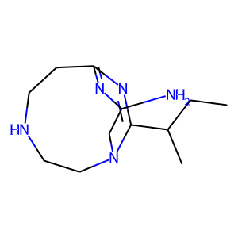

<h1>SmileRNN</h1>

SmileRNN is a generative RNN with policy gradient optimization for chemical molecules.

Use SmileRNN to generate novel, unique molecules with optimized QED scores, a measure of pharmacological potential.

Molecules are represented in simplified molecular-input line-entry system (SMILES) format, SMILES data are accessed from ChEMBL.

<h2>Example</h2>



https://www.ebi.ac.uk/chembl/ \
Bickerton, G. Richard, et al. "Quantifying the chemical beauty of drugs." Nature chemistry 4.2 (2012): 90-98.

<h2>Install</h2>

```
git clone https://github.com/mattiasgalliano/SmileRNN.git \
&& cd SmileRNN \
&& conda env create -f 'env.yml' \
&& conda activate smilernn
```

<h2>Train</h2>
Train model on SMILES strings in CSV format

```
python train.py --data data/chembl_29_smiles.csv
```

<h2>Optimize</h2>
Optimize model with policy gradient optimization

```
python optimize.py --weights weights/train_e_0 --iters 5000
```

<h2>Sample</h2>
Sample model to generate e.g. 100 molecules; save lewis structure images, plot QED score distribution

```
python sample.py --weights weights/train_e_0_optim_iter_5000 --num 100
```

<h2>Tensorboard</h2>
Visualize training, optimization experiment loss curves etc. with tensorboard

```
tensorboard --logdir runs
```
